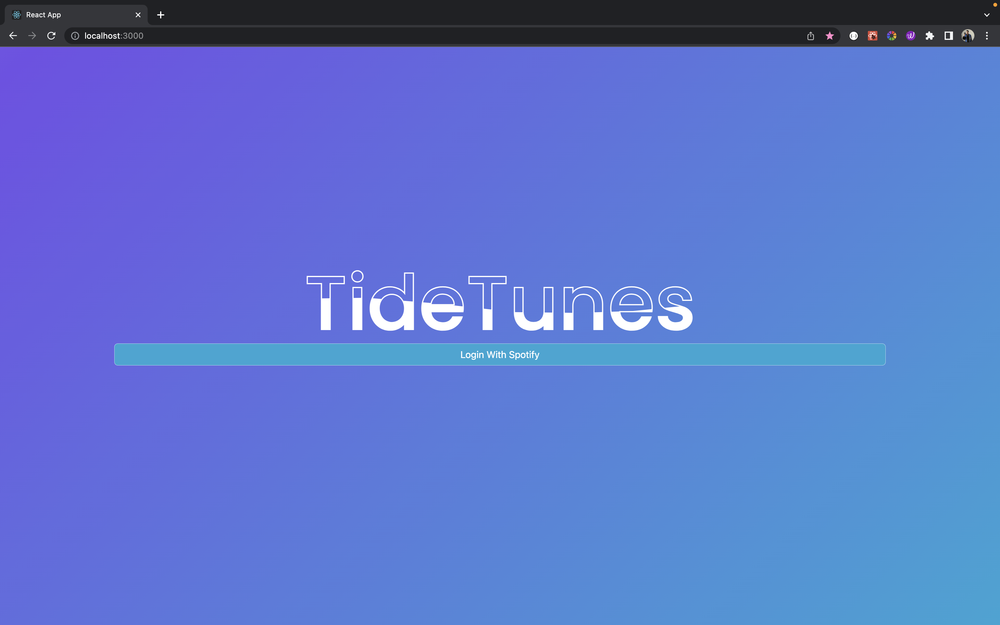
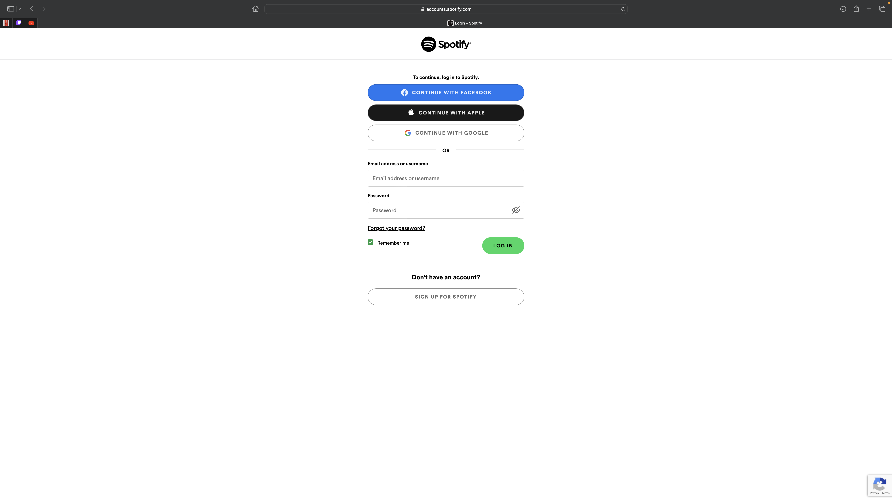
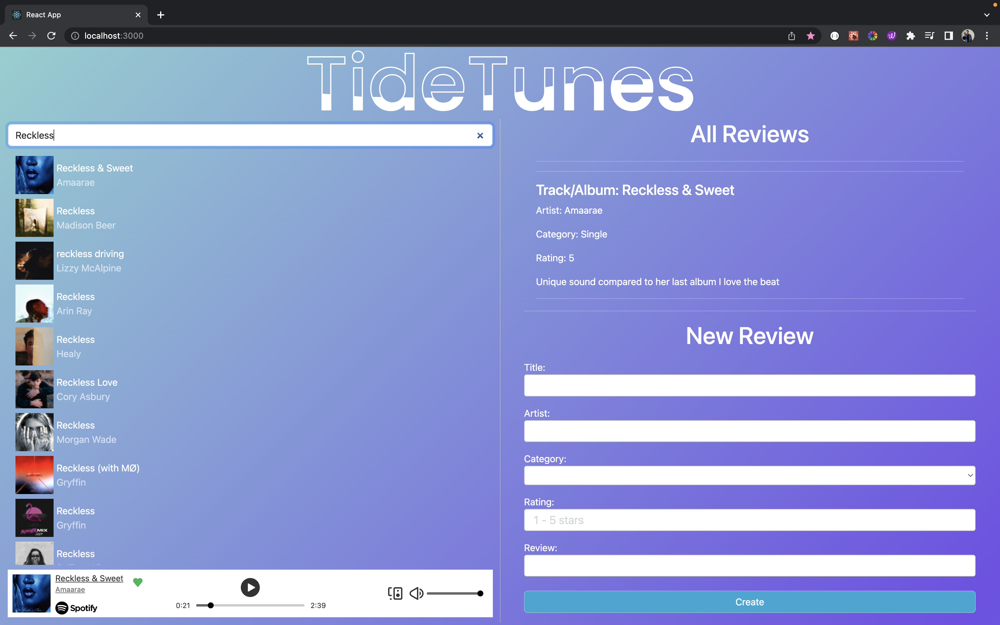

#### TideTunes - a MERN music application designed for music enthusiasts
<!-- > Live demo [_here_](https://www.example.com). -->

## Table of Contents
* [General Information](#general-information)
* [Technologies Used](#technologies-used)
* [Features](#features)
* [Screenshots](#screenshots)
* [Setup and Usage](#setup-and-usage)
* [Project Status](#project-status)
* [Room for Improvement](#room-for-improvement)
* [Contact](#contact)

## General Information
Full stack music application designed for music enthusiasts to review and track their favorite music. Developed utilizing the ***Spotify API***, MongoDB, Express React and Node.

 

## Technologies Used
* [***Spotify API***](https://developer.spotify.com/)
* [Javascript](https://www.javascript.com/)
* [React.js](https://reactjs.org/)
* [Express](https://expressjs.com/)
* [Node.js](https://nodejs.org/en/)
* [MongoDB](https://www.mongodb.com/)
* [Mongoose](https://mongoosejs.com/)

 

## Features
### User
- *Login Page* that utilizes Spotify's login and authorization.
- All encompassing *Dashboard* where users can search for and play their favorite songs utilizing the ***Spotify API***, as well as leave a review (with active validations).
- Functional filter options for list of posted reviews. 
xw
 

## Screenshots
### User Interface
Login

Dashboard

## Setup and Usage
Project requirements/dependencies for server and client are located within designated  package-lock.json and package.json files. 

        cd server
        npm install express cors mongoose dotenv spotify-web-api-node body-parser
        nodemon server.js
        nodemon reviewserver.js

        cd client
        npm install react-bootstrap bootstrap axios react-router-dom spotify-web-api-node
        npm run start

 

## Project Status
Project MVP: _Complete_. However, additional features planned.

 

## Room for Improvement

Room for improvement:
- CSS Responsiveness
> Aesthetic design and ease of use across a variety of device screen sizes 
- CSS File Organization
> Potentially allocate a CSS file for each page
 

To do:
- CSS responsiveness

- Incorproate results from ***Spotify API*** into review form for ease of use

- Allow users to click on review title to play songs on ***Spotify API***

- Allow users to cycle through their Spotify Playlists

 

## Contact
Created by [@HamzehSamhouri](https://www.linkedin.com/in/hamzehsamhouri/) - feel free to contact me!
